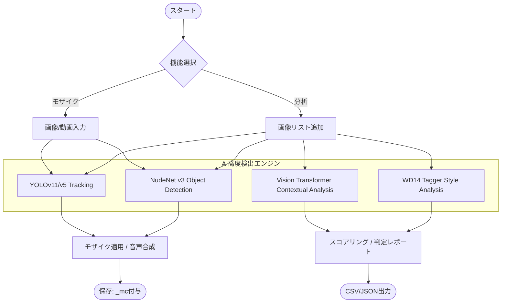

# NSFW自動モザイク ＆ 多機能チェッカー Pro

このツールセットは、AI（YOLOv11/v5, ViT, NudeNet等）を用いて、画像・動画内のNSFW領域を自動検出し、モザイク処理や詳細なコンテンツ分析を行うための統合パッケージです。

## 🌟 主な機能

- **[NEW] nsfw-checker-pro**: 5つのAIエンジンを搭載した統合型GUI分析ツール。
- **自動モザイク (画像/動画)**: YOLO検出に基づき、センシティブ領域を自動で隠蔽。
- **[NEW] 動画音声調整**: `mosaic-video-speek.py` により、モザイク処理後の動画に任意の音声を同期・合成可能。
- **マルチレイヤー検出**: YOLOに加え、NudeNetによるクロスチェック機能を搭載。

## 📂 フォルダ構成と主要ファイル

- **nsfw-checker-pro/** … 多機能NSFWチェッカー一式（GUI）
- **mosaic-video-speek.py** … 【強化版】音声調整機能付き動画モザイクスクリプト
- **mosaic-image.py** / **mosaic-video.py** … 標準モザイクスクリプト
- **start_all.bat** … 機能を一覧から選んで起動できる統合ランチャー
- **erax_nsfw_yolo11m.pt** … メインのNSFW検出モデル
- **yolov5/** … 検出エンジン
- **output/** … 処理済みファイルの保存先

## 🚀 使い方

### 1. 統合ランチャーから起動 (`start_all.bat`)
`start_all.bat` を実行するとメニューが表示されます。目的に合わせて機能を選択してください。

### 2. 統合型NSFWチェッカー (`nsfw-checker-pro`)
1. `nsfw-checker-pro/run.bat` を実行します。
2. 画像をドラッグ＆ドロップまたは選択して「スキャン開始」をクリックします。
3. 5つのエンジン（Vision API, WD14, NudeNet等）による詳細な判定結果が表示されます。

### 3. 音声付き動画モザイク (`nsfw-mosaic-video-speek.bat`)
1. バッチファイルを実行し、動画を選択します。
2. モザイクパターンを選択後、「音声を追加しますか？」の問いに「はい」を選択。
3. 合成したい音声ファイル（mp3/wav等）を選択すると、動画の長さに合わせて自動調整（トリミング/速度調整）して保存されます。

## 📊 処理フロー

## ⚠️ 注意事項

- **機密情報**: `nsfw-checker-pro/config.py` の `VISION_API_KEY` を自身のキーに設定して使用してください。
- **ライセンス**: メインスクリプトは AGPL-3.0 です。各モデルの利用規約に従ってください。

---
Developed by igashira0324
