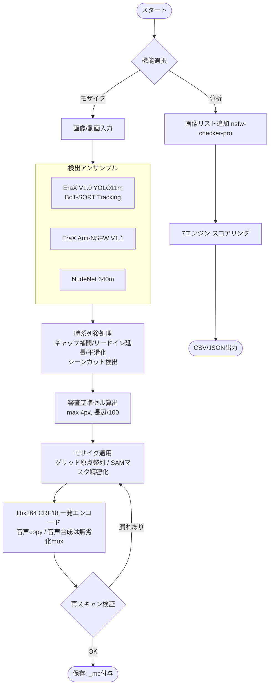

# NSFW自動モザイク ＆ 多機能チェッカー Pro

このツールセットは、AI（YOLO11/v5, ViT, NudeNet等）を用いて、画像・動画内のNSFW領域を自動検出し、モザイク処理や詳細なコンテンツ分析を行うための統合パッケージです。

## 🆕 2026-07 全面刷新 (品質・精度・準拠性の大幅強化)

最新技術動向の調査に基づき、モザイクパイプラインを全面刷新しました。

### 審査基準準拠モザイク
- セル寸法を **`max(4px, 画像長辺 ÷ 100)`** で自動算出（FANZA/審査団体系のデファクト基準）
  - 旧版の固定 8/16/32px は **FHD以上の解像度で基準不足** になり得た（FHDの基準は20px角、4Kは39px角）
  - ※法定の数値基準は存在せず、審査実務のデファクト値です。最終判断は納品先の規定に従ってください
- モザイクグリッドを**画像原点に整列**: 動画でセルが「這う」ちらつきを解消
- パターン: `モザイク標準`（基準1.0×）/ `モザイク強`（1.5×）/ `モザイク特大`（2.0×）/ `ぼかし` / `黒塗り`
  - ぼかしはAIによる復元耐性がモザイクより低いため、納品用途にはモザイク系を推奨

### 検出精度の強化
- **3モデルアンサンブル**: EraX-NSFW V1.0 + EraX-Anti-NSFW **V1.1**（新, 学習データ40k枚） + NudeNet **640m**（高精度版）
- **NudeNetのbox形式バグを修正**: 旧版は `[x,y,幅,高]` を `[x1,y1,x2,y2]` と誤解釈しており、クロスチェック層が実質無効だった
- **BGR/RGBチャネル修正**: 旧版はYOLOにRGB画像を渡しており、肌色系の検出精度を落としていた
- 静止画: TTA（Test-Time Augmentation）+ 長辺2048px以上でタイル推論（小さな対象の取りこぼし対策）
- 静止画: **MobileSAM** による箱→マスク精密化（対象の形に沿ったモザイク、失敗時は矩形に自動フォールバック）
- NudeNet を ndarray 直接入力に変更（旧版のフレーム毎一時JPEG書き出しを廃止）+ CUDA実行対応

### 動画の時間安定化（2パス方式）
- **Pass1**: BoT-SORTトラッキング検出（track_buffer=60 / 全検出を即トラック化 / カメラ移動をGMCで補償）+ シーンカット検出
- **時系列後処理**: 検出ギャップの線形補間・出現前後のリードイン/アウト延長・移動平均平滑化（被覆は常に和集合で保証＝平滑化でモザイクが狭くなることはない）
- **Pass2**: モザイク適用 + エンコード
- 旧版の「同一モデル2回推論 + 15フレーム保持」ハックを置換 → **推論回数半減 & ちらつき/出現遅れ/消え残りを解消**
- シーンカットを跨ぐ補間・延長は行わない（カット直後の誤モザイクを防止）

### エンコード品質
- 旧版: OpenCV `mp4v` 書き出し → H.264 再エンコード（**二重〜三重の世代劣化**）
- 新版: **ffmpegパイプへ直接 libx264 CRF18 一発エンコード**、音声は copy（aac/mp3）または AAC 192k
- 音声合成（speek）時も映像は `-c:v copy` で**無劣化mux**

### その他
- アニメGIF全フレーム処理 / EXIF回転の正規化 / ICCプロファイル・PNG透過保持 / WebP・BMP対応
- 進捗ウィンドウに **ETA表示 + キャンセルボタン**
- 設定ファイル `mosaic_config.json`（初回起動時に自動生成）で全パラメータ調整可能

### nsfw-checker-pro（多機能チェッカー）も同時刷新
- **[NEW] Photo Tagger エンジン追加**: `deepghs/idolsankaku-eva02-large-tagger-v1`。WD14がDanbooru学習でアニメ調に偏る弱点を補完し、実写（グラビア/アイドル系）のタグ・レーティング精度を強化
- **ViT NSFW判定を刷新**: Falconsai(2023, 二値)→ `Freepik/nsfw_image_detector`(2025, MIT)。neutral/low/medium/highの4段階重大度を確率加重で連続スコア化
- **WD14公式レーティング(rating)ヘッドを活用**: 旧版は捨てていた general/sensitive/questionable/explicit を抽出し、explicit高確度で強制格上げ
- **NudeNet 640m自動選択**: モザイク側と共有の高精度モデルを検出（`../models/nudenet_640m.onnx`）
- **LFM2.5-VLのプロンプトエコー混入バグを修正**: 生成トークンのみデコードするよう変更（旧版はプロンプト内のJSONテンプレート文字列を回答として誤パースすることがあった）。生成パラメータもタスク別に分離（安全性グレーディングは公式カード推奨値、SNS創作文生成は既存チューニングを維持）
- **コンセンサススコアのバイアス修正**: 「安全」判定のエンジンがスコア0を返すと投票から除外される旧ロジックを修正し、正常動作した全エンジンが必ず投票に参加するよう変更
- **ViT/Anime判定をGPU実行・BGR/RGBチャネル修正**

## 📂 フォルダ構成と主要ファイル

- **mosaic_core.py** … 【新】共通コアエンジン（検出/タイムライン/モザイク/エンコード）
- **mosaic_gui.py** … 【新】共通GUI部品
- **mosaic_botsort.yaml** … 【新】モザイク用BoT-SORTトラッカー設定
- **mosaic_config.json** … 【新】設定ファイル（初回起動時に自動生成）
- **mosaic-image.py** / **mosaic-video.py** … モザイクスクリプト（刷新版）
- **mosaic-video-speek.py** … 音声調整機能付き動画モザイク（刷新版）
- **download_models.bat** … 【新】追加モデル一括ダウンロード
- **erax_nsfw_yolo11m.pt** … メインのNSFW検出モデル (EraX V1.0)
- **models/** … 追加モデル（EraX V1.1 / NudeNet 640m / MobileSAM）
- **nsfw-checker-pro/** … 多機能NSFWチェッカー一式（GUI）
- **start_all.bat** … 機能を一覧から選んで起動できる統合ランチャー
- **output/** … 処理済みファイルの保存先

## 🚀 セットアップ

```bat
REM 1. 依存パッケージ (venv推奨)
venv\Scripts\python.exe -m pip install -r requirements.txt

REM 2. 追加モデルのダウンロード (初回のみ / 無くても縮退動作)
download_models.bat
```

- ffmpeg.exe が PATH に必要です
- GPU (CUDA) があれば自動使用（YOLO は FP16、NudeNet も CUDA 実行）

## 🚀 使い方

従来と同じです。`start_all.bat` から選択するか、各batを直接実行してください。

1. **画像**: `nsfw-mosaic-image.bat` → フォルダ選択 → パターン選択 → `<フォルダ>_mc` へ出力
2. **動画**: `nsfw-mosaic-video.bat` → ファイル/フォルダ選択 → パターン選択 → `output/` へ `_mc` 付きで出力
   - 完了後に**再スキャン検証**（漏れ検出→ワンクリック修正）を実行可能
3. **音声付き動画**: `nsfw-mosaic-video-speek.bat` → 動画選択 → 「音声を追加しますか？」→ 音声ファイル選択で動画長に自動調整（トリミング/速度調整/ループ）して合成

## ⚙️ チューニング (mosaic_config.json)

| 目的 | 設定 |
|---|---|
| 処理を速くしたい | `detector.imgsz: 640`（固定）、`detector.nudenet.frame_interval: 3`、`detector.yolo_models` を1つに、`video.tracker_yaml: "bytetrack.yaml"` |
| さらに検出漏れを減らしたい | `detector.yolo_conf: 0.05`、`video.pad_frames: 8`、`video.max_gap_frames: 30` |
| モザイクを強くしたい | パターンで「モザイク強/特大」を選択、または `mosaic.cell_divisor: 80` |
| モザイク範囲を広げたい | `mosaic.shrink_ratios` の値を小さくする（0でYOLO箱全体） |
| 検出対象クラスを変える | `detector.target_classes`（既定: anus/penis/vagina。nipple等を足すことも可能） |

**実測性能の目安** (RTX 3060 / フル品質構成): Pass1検出 FHD約7.5fps・SD約9fps + Pass2エンコード。
速度優先設定（単一モデル/imgsz640/ByteTrack）でおおよそ2〜3倍高速。

## 📊 処理フロー


```mermaid
flowchart TD
    Start([スタート]) --> Select{機能選択}
    Select -->|モザイク| M_Input[画像/動画入力]
    Select -->|分析| A_Input[画像リスト追加 nsfw-checker-pro]

    subgraph Detect [検出アンサンブル]
        Y0[EraX V1.0 YOLO11m<br>BoT-SORT Tracking]
        Y1[EraX Anti-NSFW V1.1]
        NN[NudeNet 640m]
    end

    M_Input --> Detect
    Detect --> TL[時系列後処理<br>ギャップ補間/リードイン延長/平滑化<br>シーンカット検出]
    TL --> Cell[審査基準セル算出<br>max 4px, 長辺/100]
    Cell --> Apply[モザイク適用<br>グリッド原点整列 / SAMマスク精密化]
    Apply --> Enc[libx264 CRF18 一発エンコード<br>音声copy / 音声合成は無劣化mux]
    Enc --> Verify{再スキャン検証}
    Verify -->|漏れあり| Apply
    Verify -->|OK| M_End([保存: _mc付与])

    A_Input --> Score[7エンジン スコアリング]
    Score --> A_End([CSV/JSON出力])
```

## ⚠️ 注意事項

- **基準について**: モザイクの数値基準は法定ではなく審査実務のデファクトです。納品先（FANZA/DLsite/審査団体等）の最新規定を必ず確認してください
- **モザイク復元AIへの耐性**: 基準セル（長辺1/100）以上であれば現行の復元AIでも「もっともらしい生成」しかできませんが、より高い耐性が必要な場合は「モザイク強」以上か「黒塗り」を使用してください。無修正の原本ファイルの管理にも注意してください
- **機密情報**: `nsfw-checker-pro/config.py` の `VISION_API_KEY` を自身のキーに設定して使用してください
- **ライセンス**: メインスクリプトは AGPL-3.0 です。各モデルの利用規約（EraX: Apache 2.0、NudeNet: AGPL-3.0、MobileSAM: Apache 2.0）に従ってください

---
Developed by igashira0324
