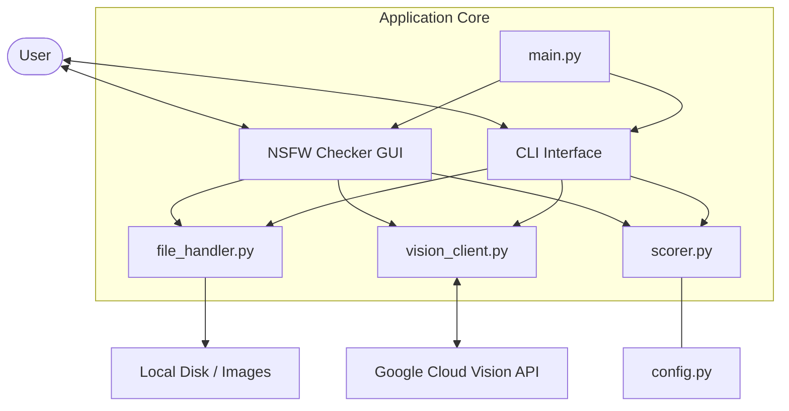
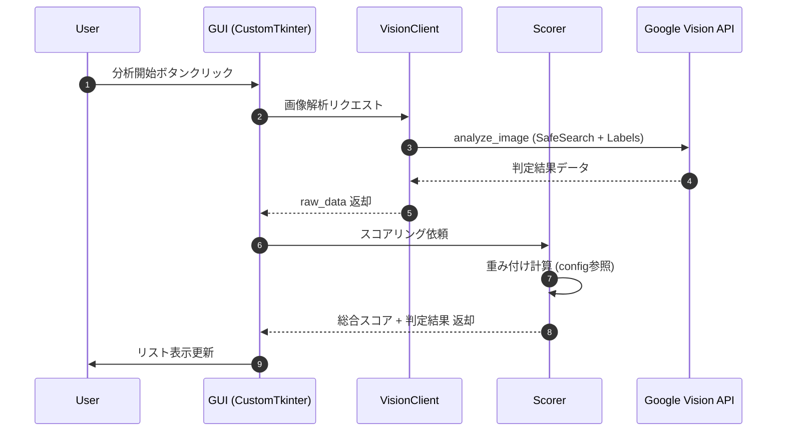

# NSFW Image Checker Pro

Google Cloud Vision API の SafeSearch Detection を使用した画像NSFWチェックツールです。
大量の画像データを、機械学習ベースの多角的な指標でスコアリングし、安全性を判定します。

## 特徴

- ✨ **GUI インターフェース**: `CustomTkinter` によるモダンなUIで直感的に操作可能
- 📊 **客観的スコアリング**: カテゴリ別（Adult, Racy, Violence等）の重み付けによる総合スコア（0-100）算出
- 🔍 **内容説明 (Labels)**: SafeSearch 判定と同時に、画像の内容を示すキーワード（ラベル）も自動取得
- 📂 **柔軟な読み込み**: 個別ファイル選択に加え、フォルダごとの一括読み込み（サブフォルダ再帰対応）が可能
- 🏷️ **5段階判定**: スコアに応じた自動判定（SAFE / LOW_RISK / MODERATE / HIGH_RISK / UNSAFE）
- 💾 **エクスポート**: 解析結果を UTF-8 シグネチャ付き CSV（Excel対応）または詳細な JSON で保存
- 🔑 **APIキー埋め込み支援**: `config.py` へのキー埋め込みにより、設定後の利便性を向上

## システム構成

### アーキテクチャ図 (Mermaid)



### 画像解析シーケンス図



## セットアップ

### 1. 依存パッケージのインストール

```bash
pip install -r requirements.txt
```

### 2. Google Cloud Vision API キーの設定

1. [Google Cloud Console](https://console.cloud.google.com/) で APIキーを作成（Cloud Vision API を有効化してください）
2. [config.py](config.py) を開き、`API_KEY` 変数に取得したキーを貼り付けます。

```python
# config.py
API_KEY = "あなたのAPIキー"
```

## 使用方法

### GUI モードで起動（推奨）

引数なしで実行すると GUI が立ち上がります。

```bash
python main.py
```

1. **ファイルを個別に選択** または **フォルダを一括選択** で画像を追加。
2. **分析を開始する** をクリック。
3. リスト内の画像を選択して **右クリック** で個別削除や個別エクスポートも可能。
4. **判定基準（活用ガイド）** ボタンで、スコアの根拠や運用例を確認できます。

### CLI モードで起動

バッチ処理やスクリプト連携が必要な場合に使用します。

```bash
# フォルダ内の画像を再帰的に全件チェック
python main.py ./images --recursive

# 特定の閾値以上のものだけ JSON で出力
python main.py ./images --threshold 40 --output risky.json
```

## スコアリング詳細

詳しい判定基準、各カテゴリの重み付けの意図、および API の精度特性については [REFERENCE_SHEET.md](REFERENCE_SHEET.md) を参照してください。

## 注意事項

- **API 料金**: Google Cloud Vision API は従量課金制です（無料枠の範囲内でご利用ください）。
- **セキュリティ**: `config.py` に API キーを記載したまま GitHub 等の公開リポジトリにアップロードしないよう、`.gitignore` の設定を確認してください。
